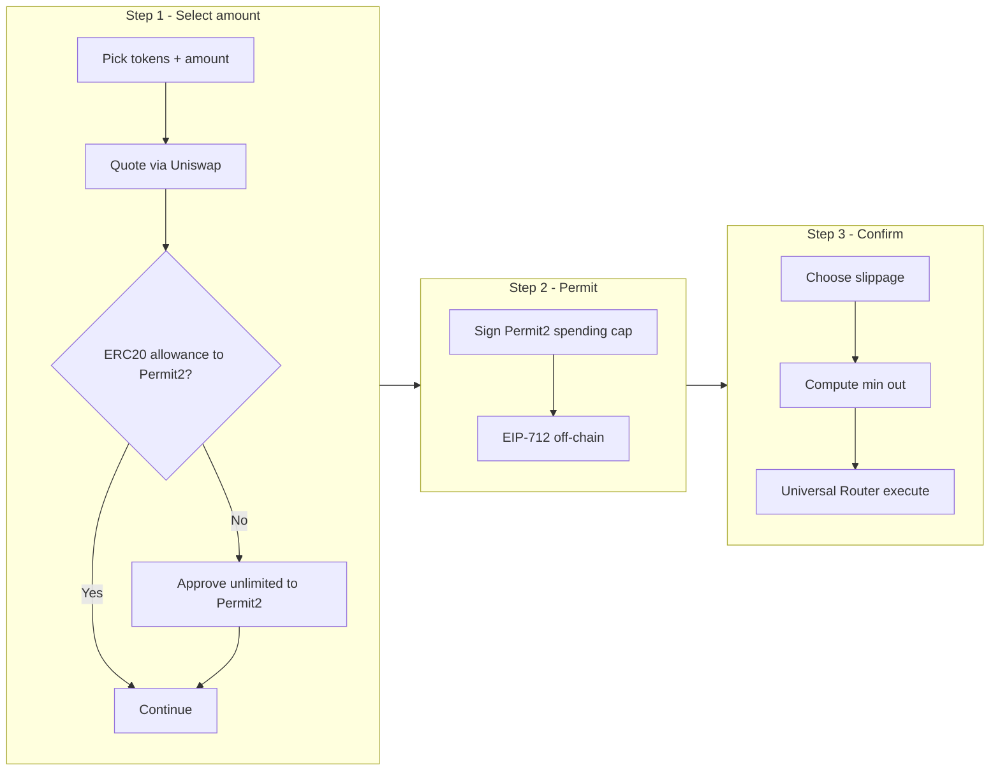

# Swap feature — architecture and onboarding guide

This document explains how token swapping works in this repository: user journey, supported assets, state, quoting, on-chain execution, and where to read code. It is written for junior engineers, QA, and product owners who need a reliable mental model without reading the whole codebase first.

**Branch / baseline:** Documentation was authored on branch `dao-2217` (created from `origin/dao-2226`). Swap logic lives primarily under `src/lib/swap/`, `src/shared/stores/swap/`, `src/app/user/Swap/`, and `src/app/api/swap/`.

---

## 1. What swapping does (one paragraph)

The app lets users trade between **three fixed tokens** (USDT0, USDRIF, RIF) on Rootstock using **Uniswap V3** infrastructure: **QuoterV2** estimates output or required input, and the **Universal Router** executes a **V3 exact-in swap**. For **USDRIF ↔ RIF** there is **no direct pool in the routing table**, so the product uses a **two-hop path through USDT0**. Approvals use **Permit2**: the user first approves the ERC-20 to Permit2, then signs an EIP-712 **spending cap**, and finally sends **one transaction** that runs **PERMIT2_PERMIT + V3_SWAP_EXACT_IN** on the Universal Router.

---

## 2. Supported tokens and pairs

| Symbol  | Role in product | Notes |
|---------|-----------------|--------|
| **USDT0** | Primary stable routing asset | Bridge token for USDRIF ↔ RIF |
| **USDRIF** | Dollar-pegged RIF derivative | Pairs directly with USDT0 |
| **RIF**   | Native/governance-oriented asset | Reaches USDRIF via USDT0 multihop |

Canonical lists in code:

- `SWAP_FLOW_TOKEN_SYMBOLS` and `SWAP_TOKEN_ADDRESSES` in `src/lib/swap/constants.ts` — addresses come from `tokenContracts` / env (`NEXT_PUBLIC_*_ADDRESS`).
- UI token metadata (decimals, names) in `src/shared/stores/swap/useSwapTokens.ts`.

**Important:** Other DEX names appear in constants (`ICECREAMSWAP`, `OPENOCEAN`) for future or historical wiring, but **quotes and execution in this branch use Uniswap only** (`uniswapProvider`).

---

## 3. End-to-end user flow (UI)

The swap UI is a **modal wizard** (`SwappingFlow`), opened from the vault area (`VaultActions` renders `SwappingFlow` when the user opens swap).



| Step | File | User-visible purpose |
|------|------|---------------------|
| 1 | `SwapStepOne.tsx` | Enter **exact-in** or **exact-out** amount, pick fee tier (Auto or fixed), optional % of balance, flip tokens, continue or **Approve & Continue** |
| 2 | `SwapStepTwo.tsx` | **Sign spending cap** (Permit2 + Universal Router); auto-skips if prior signature still covers amount |
| 3 | `SwapStepThree.tsx` | Review from/to, pick **slippage**, see **minimum received**, confirm **one on-chain tx** |

Supporting UI:

- `SwappingFlow.tsx` — modal shell, progress bar, step routing, resets `useSwapStore` on close.
- `SwapSteps.tsx` — step labels (SELECT AMOUNT → REQUEST ALLOWANCE → CONFIRM SWAP).
- `SwapInputComponent.tsx` — amount input, token dropdown, USD hint, balance line.
- `SwapStepWarning.tsx` / `LowLiquidityWarning` — standardized warning styling; low-liquidity copy from `low-liquidity-warning.ts`.
- `useSwapSmartDefault.ts` — on modal open, if user has no USDT0, prefers USDRIF or RIF as “From” (`smart-default-direction.ts`).

---

## 4. Architecture layers

| Layer | Responsibility |
|-------|----------------|
| **UI (Swap steps)** | Collects intent, drives wagmi txs/signing, shows warnings |
| **Zustand (`useSwapStore`)** | Tokens, typed amount, mode, fee tier selection, permit payload, swap tx lifecycle |
| **Hooks (`shared/stores/swap/hooks.ts`)** | Quotes (React Query), allowance, permit signing, swap execution |
| **`src/lib/swap`** | Route resolution, Uniswap path encoding, Quoter calls, Universal Router calldata, Permit2 helpers |
| **API `GET /api/swap/quote`** | Server-side quote using same provider stack (integrators, tests, or future clients) |
| **On-chain** | ERC20 `approve` → Permit2; `UniversalRouter.execute` with bundled permit + swap |

**Dual quote paths (good to know for QA):**

- **In-modal quotes** call `uniswapProvider` **directly from the browser** via `useSwapInput` (same logic as server, but no HTTP hop).
- **`useSwapQuote`** + **`/api/swap/quote`** exist for **HTTP/React Query** consumers; the live wizard does **not** depend on `useSwapQuote`.

---

## 5. Routing: when swaps are one-hop vs multihop

`resolveSwapRoute(tokenIn, tokenOut)` in `src/lib/swap/routes.ts` returns an ordered list of token addresses:

- **Default:** `[tokenIn, tokenOut]` (single hop).
- **USDRIF ↔ RIF:** `[USDRIF, USDT0, RIF]` or `[RIF, USDT0, USDRIF]` depending on direction.

Helpers:

- **`isMultihopRoute`** — `tokens.length > 2`.
- **`getSwapRouteCacheKey`** — stable string for React Query keys.

**Why it exists:** Uniswap V3 quotes and swaps need a **path** of `(token, fee, token, fee, …)`. The resolver fixes topology so Quoter and execution always agree on intermediates.

---

## 6. Fee tiers vs slippage (frequent confusion)

- **Fee tier (pool fee):** Uniswap V3 splits liquidity into pools with fees **100, 500, 3000, 10000** (basis points of the trade, i.e. 0.01%–1%). **Auto** mode asks the Quoter for many combinations and picks the economically best result. **Manual** tier on a multihop route uses the **same** uint24 fee on **every** hop (uniform path).
- **Slippage (Step 3):** User-selected protection on **minimum output** (`amountOutMinimum`) for the **V3_SWAP_EXACT_IN** command. It is **not** the pool fee.

---

## 7. Permit2 and Universal Router

1. **ERC-20 `approve(token, Permit2, MAX)`** — one-time per token (Step 1). Implemented in `useTokenAllowance` via standard `approve` (ABI reused from `RIFTokenAbi` for ERC20).
2. **`signTypedData` PermitSingle** — authorizes Universal Router to pull **exactly** the signed amount from Permit2 (Step 2). Built with `createSecurePermit` in `src/lib/swap/permit2.ts`; nonce read from Permit2 `allowance(owner, token, spender)`.
3. **`execute(commands, inputs)`** on Universal Router — `getPermitSwapEncodedData` encodes **`0x0a` (PERMIT2_PERMIT) + `0x00` (V3_SWAP_EXACT_IN)** with the V3 path bytes (`src/lib/swap/providers/uniswap.ts`).

If execution fails with **AllowanceExpired** (`0xd81b2f2e`), the user must return to Step 2 and sign again (handled in `useSwapExecution`).

---

## 8. Reference: main functions and types

Below: **what it does**, **why it exists**, **role in swapping**.

### 8.1 `src/lib/swap/constants.ts`

| Export | Role |
|--------|------|
| `SWAP_TOKEN_ADDRESSES` | Central map of swap-eligible token addresses |
| `SWAP_FLOW_TOKEN_SYMBOLS` | The three symbols exposed in the UI |
| `ROUTER_ADDRESSES` / `POOL_ADDRESSES` | Env-backed contract addresses for quoting and hints |
| `SWAP_PROVIDERS` | Provider name union (`uniswap`, etc.) |
| `UNISWAP_FEE_TIERS` | `[100, 500, 3000, 10000]` |
| `feeTierToPercent` | Display helper (tier / 10_000) |

### 8.2 `src/lib/swap/routes.ts`

| Function | Why |
|----------|-----|
| `resolveSwapRoute` | Deterministic path for Quoter + execution (incl. USDRIF–RIF via USDT0) |
| `isMultihopRoute` | Branches quoting/encoding logic |
| `getSwapRouteCacheKey` | Invalidates React Query when pair topology changes |

### 8.3 `src/lib/swap/utils.ts`

| Function | Why |
|----------|-----|
| `scaleAmount` | Human string → `bigint` via `viem` `parseUnits` (API route) |
| `isValidAmount` | Positive decimal guard for API |
| `getTokenDecimals` | On-chain `decimals()` read (single token) |
| `getTokenDecimalsBatch` | Multicall decimals for API (one round-trip, deduped addresses) |
| `calculatePriceImpact` | **Utility** comparing effective vs spot price; used in tests / future UI, not wired into the current swap modal quote display |

### 8.4 `src/lib/swap/multicallWithGasEnvelopeRetry.ts`

| Function | Why |
|----------|-----|
| `multicallWithGasEnvelopeRetry` | Some RPCs reject large `aggregate3` calls; retries with smaller batches |
| `isLikelyOuterMulticallRpcFailure` | Classifies outer RPC failures vs per-call reverts |

### 8.5 `src/lib/swap/providers/uniswap.ts` (core provider)

**Path encoding**

| Function | Role |
|----------|------|
| `encodeFeeUint24Hex` | Packs uint24 fee into path bytes |
| `encodeUniformFeeSwapPath` | Same fee every hop |
| `encodePerHopFeeSwapPath` | Distinct fee per hop (Auto multihop search) |

**Quoting**

| Function | Role |
|----------|------|
| `getUniswapQuote` / `getUniswapExactOutputQuote` | Main entry: resolve route, single-hop vs multihop, Auto vs explicit tier |
| `getBestQuoteFromAllTiers` / `getBestExactOutputFromAllTiers` | Multicall all single-hop tiers, pick best |
| `getBestMultihopQuoteExactIn` / `…ExactOut` | Cartesian product of tier combinations (up to 3 hops policy) |
| `cartesianFeeCombinations` | Builds fee lists for multihop probes |

**Execution helpers**

| Function | Role |
|----------|------|
| `getSwapEncodedData` | `V3_SWAP_EXACT_IN` only (no permit) — lower-level building block |
| `getPermitSwapEncodedData` | **Production path**: permit + swap commands for Universal Router |
| `getAvailableFeeTiers` | Probes which tiers return positive output (powers Step 1 fee buttons) |

**Export**

| Export | Role |
|--------|------|
| `uniswapProvider` | `SwapProvider` implementation (`getQuote`, `getQuoteExactOutput`) |

**Error handling:** Infrastructure errors propagate; Quoter reverts often become user-facing “no liquidity” messages (`swapQuoteNoLiquidityExplicitTier`).

### 8.6 `src/lib/swap/permit2.ts`

| Area | Role |
|------|------|
| Types (`PermitSingle`, `PermitDetails`, …) | Match Uniswap Permit2 EIP-712 layout |
| `validateSpender`, `validateAmount`, `validateExpiration`, `validateNonce`, `validateChainId`, `validateToken` | Defense-in-depth before signing |
| `validatePermitParams` | Aggregates validation for tooling/tests |
| `createPermitSingle` | Builds struct + deadlines |
| `createPermit2Domain` / `createTypedDataForPermit` | Wallet `signTypedData` input |
| `createSecurePermit` | **Used in app** — validates then returns permit + typed data |
| `validateSignatureFormat` | Basic hex length / `v` checks |

### 8.7 `src/lib/swap/providers/index.ts`

Defines **`SwapProvider`**, **`SwapQuote`**, **`QuoteParams`**, **`QuoteExactOutputParams`** — shared interface if additional DEX adapters are added later.

### 8.8 `src/shared/stores/swap/useSwapStore.ts`

Zustand actions: token pair, `mode` + `typedAmount`, fee tier, permit blobs, swap/approval tx hashes, `reset` on modal close. **Quotes and allowances are not stored here** (React Query / wagmi).

### 8.9 `src/shared/stores/swap/hooks.ts`

| Hook | Role |
|------|------|
| `useSwapInput` | Debounced quoting, exact-in/out switching, `availableFeeTiers`, quote staleness (~30s), syncs `poolFee` from quote |
| `useTokenSelection` | Thin wrapper over store + `useSwapTokens` |
| `useTokenAllowance` | Reads allowance to Permit2; `approve` unlimited to Permit2 |
| `usePermitSigning` | Fetches Permit2 nonce, `createSecurePermit`, `signTypedData` |
| `useSwapExecution` | `getPermitSwapEncodedData` + `execute` on Universal Router |

Helper **`normalizeQuoteResult`** maps provider response into **`QuoteResult`** (bigint fields for UI math).

### 8.10 `src/app/api/swap/quote/route.ts`

| Piece | Role |
|-------|------|
| `GET` | Validates addresses/amount, batch-reads decimals, calls `uniswapProvider.getQuote`, returns `{ quotes }` |
| `revalidate = 30` | Next.js cache hint aligned with quote TTL |

### 8.11 `src/shared/hooks/useSwapQuote.ts`

React Query wrapper around **`/api/swap/quote`**. Useful for **non-modal** consumers; swap modal uses **`useSwapInput`** instead.

### 8.12 User swap utilities

| Module | Role |
|--------|------|
| `smart-default-direction.ts` | `getSmartDefaultSwapDirection` — balance-based default pair |
| `low-liquidity-warning.ts` | `shouldShowLowLiquidityWarning` — USD-based or stable-to-stable heuristic, >5% loss warning |

---

## 9. Environment variables (operations)

Swap-related **public** env vars (see `src/lib/constants.ts`):

- Token addresses: `NEXT_PUBLIC_USDT0_ADDRESS`, `NEXT_PUBLIC_USDRIF_ADDRESS`, `NEXT_PUBLIC_RIF_ADDRESS`, …
- DEX: `NEXT_PUBLIC_UNISWAP_UNIVERSAL_ROUTER_ADDRESS`, `NEXT_PUBLIC_UNISWAP_QUOTER_V2_ADDRESS`
- Permit2: `NEXT_PUBLIC_PERMIT2_ADDRESS` (Rootstock may differ from mainnet canonical)
- Pool hint: `NEXT_PUBLIC_USDT0_USDRIF_POOL_ADDRESS`
- Chain: `NEXT_PUBLIC_CHAIN_ID`, `NEXT_PUBLIC_ENV`, etc.

Local / fork setup may be documented in `docs/FORK_SETUP.md` (general chain tooling).

---

## 10. Tests as executable spec

| Area | Test file |
|------|-----------|
| Uniswap provider / path / quotes | `src/lib/swap/providers/uniswap.test.ts` |
| Routes | `src/lib/swap/routes.test.ts` |
| Utils | `src/lib/swap/utils.test.ts` |
| Multicall retry | grep / future — logic in `multicallWithGasEnvelopeRetry.ts` |
| Quote API | `src/app/api/swap/quote/route.test.ts` |
| Store | `src/shared/stores/swap/useSwapStore.test.ts` |
| `useSwapInput` / quote hook | `src/shared/hooks/useSwapQuote.test.tsx`, `useSwapQuote` |
| Step 1 UI | `src/app/user/Swap/Steps/SwapStepOne.test.tsx` |
| Smart default | `src/app/user/Swap/hooks/useSwapSmartDefault.test.ts` |
| Low liquidity | `src/app/user/Swap/utils/low-liquidity-warning.test.ts` |

Running tests (from repo root): use the project’s usual command (e.g. `npm test` / `npx vitest`) as defined in `package.json`.

---

## 11. Further reading (external)

- [Uniswap V3 Core concepts](https://docs.uniswap.org/concepts/protocol/concentrated-liquidity) — pools, price ranges, fees  
- [Uniswap V3 Swap Router / Universal Router](https://docs.uniswap.org/contracts/universal-router/overview) — command encoding  
- [Permit2 overview](https://docs.uniswap.org/contracts/permit2/overview) — signature-based allowances  
- [QuoterV2](https://docs.uniswap.org/contracts/v3/reference/periphery/lens/QuoterV2) — `quoteExactInput` / `quoteExactOutput` and multihop paths  

---

## 12. Quick file map

```
src/lib/swap/
  constants.ts          # Token + router constants, fee tiers
  types.ts              # SwapQuoteMode
  utils.ts              # Amount/decimals helpers
  routes.ts             # USDRIF↔RIF via USDT0
  permit2.ts            # EIP-712 permit helpers
  multicallWithGasEnvelopeRetry.ts
  providers/uniswap.ts  # Quoter + Universal Router encoding
src/shared/stores/swap/
  useSwapStore.ts       # Zustand UI state
  useSwapTokens.ts      # Static token metadata
  hooks.ts              # Quote, allowance, permit, execution
src/app/user/Swap/      # Modal, steps, warnings, smart default
src/app/api/swap/quote/ # HTTP quote API
```

---

*For questions about chain forking or env profiles, start with `docs/FORK_SETUP.md`. For feature flags or app config, see `src/config/`.*
