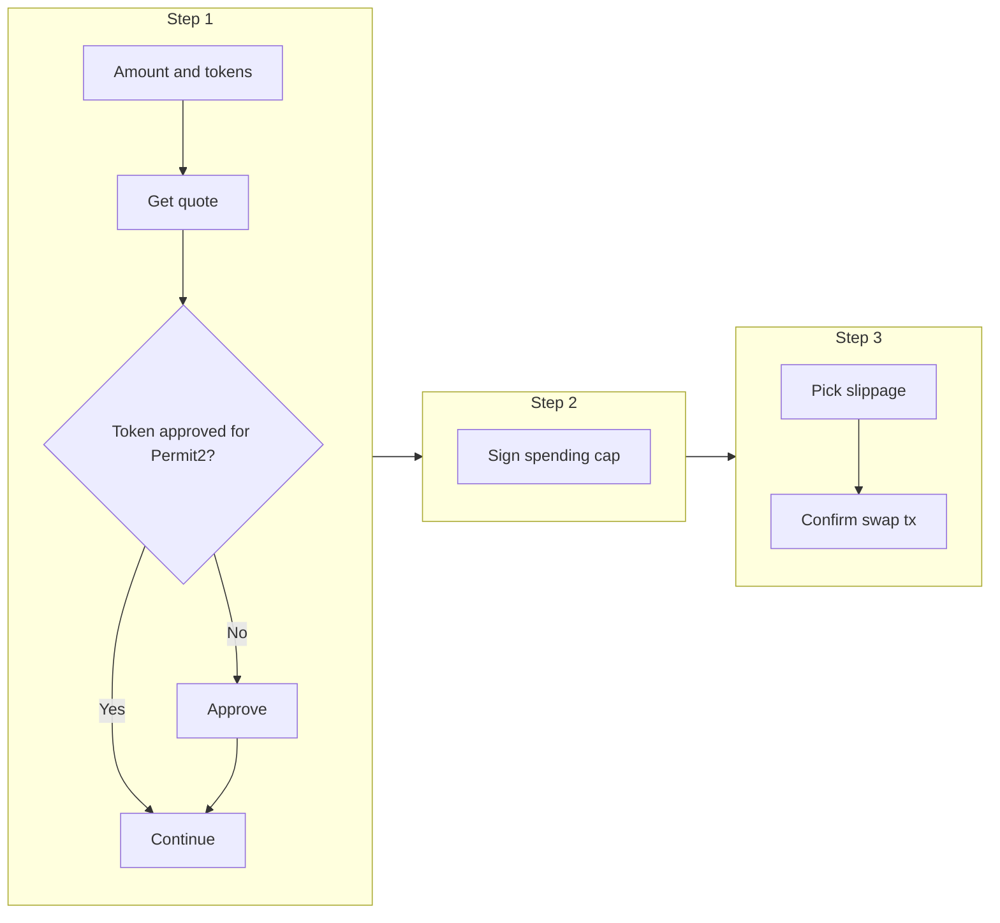

# How swapping works in this app

You can swap **three tokens only**: USDT0, USDRIF, and RIF. The app asks the chain how much you would get (a **quote**), then helps you approve and sign, then runs the trade on **Uniswap V3** on Rootstock.

Most code for this lives in:

- `src/lib/swap/` — math, paths, quotes, and transaction data
- `src/shared/stores/swap/` — what the screen remembers and the React hooks that talk to the chain
- `src/app/user/Swap/` — the swap popup and its three steps
- `src/app/api/swap/` — an HTTP endpoint that can get a quote (same idea as inside the popup)

*This file was added on branch `dao-2217` (from `origin/dao-2226`).*

---

## 1. The big picture

**What the user does**

1. Pick how much to send or how much they want to receive.
2. The app shows an estimate from **QuoterV2** (a read-only contract that simulates the swap).
3. If needed, they approve the token for **Permit2** (a helper contract Uniswap uses).
4. They sign a **spending cap** in the wallet (no gas for this step — it is just a signature).
5. They confirm **one** on-chain transaction. The **Universal Router** runs the permit step and then the **V3_SWAP_EXACT_IN** swap in the same transaction.

**USDRIF and RIF**

There is no single pool that swaps USDRIF and RIF directly in our route list. So the app always routes that pair through **USDT0**: for example USDRIF → USDT0 → RIF (two steps on the path, called **multihop**).

---

## 2. The three tokens

| Token   | Plain meaning |
|---------|----------------|
| **USDT0** | Stable value token; also used as the “middle” hop between USDRIF and RIF. |
| **USDRIF** | A dollar-linked RIF-related token; swaps straight against USDT0. |
| **RIF**   | The main RIF token; to reach USDRIF the path goes through USDT0. |

Where the addresses and symbols are set:

- `src/lib/swap/constants.ts` — `SWAP_TOKEN_ADDRESSES`, `SWAP_FLOW_TOKEN_SYMBOLS`
- `src/shared/stores/swap/useSwapTokens.ts` — names and decimals for the UI

You may see other exchange names in constants (for example IceCream, OpenOcean). **Right now only Uniswap is wired up** for real quotes and swaps (`uniswapProvider`).

---

## 3. The three steps in the popup

The swap screen is a **modal** (`SwappingFlow`). It opens from the vault actions area when the user chooses swap.



| Step | Code file | What the user sees |
|------|-----------|-------------------|
| 1 | `SwapStepOne.tsx` | Type **amount in** or **amount out**, pick pool fee (**Auto** or a fixed tier), optional % of balance, flip direction, then **Continue** or **Approve & Continue**. |
| 2 | `SwapStepTwo.tsx` | **Sign spending cap** so the router can spend the exact amount. If an old signature still covers the amount, this step can skip ahead. |
| 3 | `SwapStepThree.tsx` | Check summary, pick **slippage**, see **minimum you receive**, press **Confirm swap**. |

Other pieces:

- `SwappingFlow.tsx` — popup frame, progress bar, which step is shown; clears swap state when closed.
- `SwapSteps.tsx` — the labels: SELECT AMOUNT → REQUEST ALLOWANCE → CONFIRM SWAP.
- `SwapInputComponent.tsx` — amount box, token picker, balance, USD hint.
- `SwapStepWarning.tsx` / `LowLiquidityWarning` — warning layout and the low-liquidity message.
- `useSwapSmartDefault.ts` + `smart-default-direction.ts` — when the popup opens, if the user has no USDT0, the app may default “From” to USDRIF or RIF so they do not have to fix tokens first.

---

## 4. How the code is split (layers)

Think of it as layers from the screen down to the chain:

| Layer | Job |
|-------|-----|
| Swap step components | Buttons, inputs, warnings; start wallet actions. |
| **`useSwapStore` (Zustand)** | Which tokens, typed amount, fee choice, permit data, swap transaction state. **Live quote numbers are not stored here** — they come from React Query in the hooks. |
| **`hooks.ts`** | Fetches quotes, checks allowance, signs permit, sends the swap transaction. |
| **`src/lib/swap`** | Builds the route, talks to **QuoterV2**, builds **Universal Router** calldata, Permit2 helpers. |
| **`GET /api/swap/quote`** | Same quote logic on the server (tests, other callers, or future features). |
| Chain | `approve` on the token; `execute` on the Universal Router. |

**Two ways to get a quote (easy to mix up)**

- **Inside the popup:** `useSwapInput` calls `uniswapProvider` **in the browser** (no HTTP round trip).
- **HTTP:** `useSwapQuote` calls **`/api/swap/quote`**. The popup does **not** use `useSwapQuote`.

---

## 5. Route: one hop or two hops

`resolveSwapRoute` in `src/lib/swap/routes.ts` returns the ordered list of token addresses.

- **Most pairs:** two tokens only — one hop.
- **USDRIF ↔ RIF:** three tokens — always through USDT0.

Small helpers:

- `isMultihopRoute` — true when there are more than two tokens in the list.
- `getSwapRouteCacheKey` — a string key so React Query does not reuse the wrong cached quote when the pair changes.

**Why:** Uniswap V3 needs a **path**: token, fee, token, fee, … The resolver makes sure the quote step and the send-transaction step use the **same** path.

---

## 6. Pool fee vs slippage (not the same thing)

**Pool fee (fee tier)**

Uniswap splits liquidity into pools with different trading fees. Our app uses the standard tiers **100, 500, 3000, 10000** (think of them as **0.01%**, **0.05%**, **0.3%**, **1%** of the trade).

- **Auto:** the app asks for many combinations and picks the best outcome.
- **Manual tier on a multihop path:** the **same** fee tier is used on **every** hop (uniform path).

**Slippage (step 3)**

The user picks how much worse than the quote they still accept (for example 0.5%). The app turns that into a **minimum output** amount for the swap command. That is **slippage**, not the pool fee.

---

## 7. Permit2 and Universal Router (short version)

1. **Approve** — Step 1 may send an ERC-20 `approve` so **Permit2** is allowed to move the token (`useTokenAllowance`). The app often approves the maximum once so the user is not asked again and again.
2. **Sign** — Step 2 builds a **PermitSingle** message and the user signs it (`createSecurePermit` in `permit2.ts`). This says how much the **Universal Router** may pull via Permit2.
3. **Swap** — Step 3 sends one transaction to **Universal Router** `execute`. The payload bundles **PERMIT2_PERMIT** then **V3_SWAP_EXACT_IN** (`getPermitSwapEncodedData` in `uniswap.ts`).

If the wallet error mentions **AllowanceExpired** (or code `0xd81b2f2e`), the signed cap expired or is wrong — go back to Step 2 and sign again (`useSwapExecution` handles that message).

---

## 8. What each main piece of code does

Short notes: **what** / **why it matters for swapping**.

### `src/lib/swap/constants.ts`

| Name | What it does |
|------|----------------|
| `SWAP_TOKEN_ADDRESSES` | Addresses for the three swap tokens. |
| `SWAP_FLOW_TOKEN_SYMBOLS` | The three symbols shown in the UI. |
| `ROUTER_ADDRESSES`, `POOL_ADDRESSES` | Contract addresses from env. |
| `UNISWAP_FEE_TIERS` | The four fee numbers the app tries. |
| `feeTierToPercent` | Turns a tier into a percent string for display. |

### `src/lib/swap/routes.ts`

| Function | What it does |
|----------|----------------|
| `resolveSwapRoute` | Picks the token list for the path (adds USDT0 between USDRIF and RIF when needed). |
| `isMultihopRoute` | True if the path has more than one hop. |
| `getSwapRouteCacheKey` | Cache key for quotes when the route changes. |

### `src/lib/swap/utils.ts`

| Function | What it does |
|----------|----------------|
| `scaleAmount` | Turns a typed string amount into chain units (`bigint`) for the API. |
| `isValidAmount` | Rejects empty or non-positive amounts for the API. |
| `getTokenDecimals` | Reads `decimals()` from one token contract. |
| `getTokenDecimalsBatch` | Reads decimals for several tokens in one multicall (used by the quote API). |
| `calculatePriceImpact` | Helper for comparing price vs a reference; **not** shown in the swap modal today (tests / future use). |

### `src/lib/swap/multicallWithGasEnvelopeRetry.ts`

| Function | What it does |
|----------|----------------|
| `multicallWithGasEnvelopeRetry` | Batches many read calls; if the RPC rejects the big batch (gas limit), retries with smaller batches. |
| `isLikelyOuterMulticallRpcFailure` | Helps tell “whole batch failed” from “one pool call reverted”. |

### `src/lib/swap/providers/uniswap.ts`

**Building paths**

| Function | What it does |
|----------|----------------|
| `encodeUniformFeeSwapPath` | Path bytes with one fee for every hop. |
| `encodePerHopFeeSwapPath` | Path bytes when each hop can have its own fee. |

**Quotes**

| Function | What it does |
|----------|----------------|
| `getUniswapQuote` / `getUniswapExactOutputQuote` | Main quote entry: picks route, single vs multihop, Auto vs fixed fee. |
| `getBestQuoteFromAllTiers` / `getBestExactOutputFromAllTiers` | Single hop: try all four fees, pick best. |
| `getBestMultihopQuoteExactIn` / `…ExactOut` | Multihop: try fee combinations, pick best. |
| `cartesianFeeCombinations` | Builds the list of fee combinations to try. |

**Transactions**

| Function | What it does |
|----------|----------------|
| `getSwapEncodedData` | Swap command only (no permit) — building block. |
| `getPermitSwapEncodedData` | What production uses: permit + swap for the Universal Router. |
| `getAvailableFeeTiers` | Finds which fee tiers return a real quote (powers the fee buttons on step 1). |

**Export:** `uniswapProvider` — object with `getQuote` and `getQuoteExactOutput`.

### `src/lib/swap/permit2.ts`

Types and helpers for the EIP-712 permit (must match Permit2 on chain). Important pieces:

- `createSecurePermit` — builds safe permit data for the wallet to sign (used in the app).
- `validateSpender`, `validateAmount`, `validateExpiration`, `validateNonce`, etc. — safety checks before signing.

### `src/lib/swap/providers/index.ts`

Shared TypeScript types for a “provider” (`SwapQuote`, `QuoteParams`, …) so another DEX could be added later with the same shape.

### `src/shared/stores/swap/useSwapStore.ts`

Zustand store: tokens in/out, input mode, amounts typed, fee tier choice, permit + signature, swap tx hash and errors, reset on close.

### `src/shared/stores/swap/hooks.ts`

| Hook | What it does |
|------|----------------|
| `useSwapInput` | Debounced quotes, exact-in vs exact-out, fee tier list, marks quote “old” after ~30s, copies fee from quote into store for execution. |
| `useTokenSelection` | Token in/out and metadata. |
| `useTokenAllowance` | Read allowance to Permit2; send `approve` if needed. |
| `usePermitSigning` | Read nonce, build permit, call `signTypedData`. |
| `useSwapExecution` | Build router calldata and send `execute`. |

`normalizeQuoteResult` turns the provider response into a `QuoteResult` the UI can use (bigints).

### `src/app/api/swap/quote/route.ts`

`GET` handler: checks inputs, reads decimals, calls `uniswapProvider.getQuote`, returns JSON. Cached for about 30 seconds (`revalidate`).

### `src/shared/hooks/useSwapQuote.ts`

Fetches `/api/swap/quote` with React Query. **The swap popup does not use this**; the popup uses `useSwapInput` instead.

### `src/app/user/Swap/utils/`

| File | What it does |
|------|----------------|
| `smart-default-direction.ts` | Picks default “From” / “To” from balances when the modal opens. |
| `low-liquidity-warning.ts` | Decides whether to show the “not enough liquidity” style warning (uses USD prices when possible). |

---

## 9. Environment variables

Public env keys used for swap-related addresses (full list in `src/lib/constants.ts`):

- Token addresses: `NEXT_PUBLIC_USDT0_ADDRESS`, `NEXT_PUBLIC_USDRIF_ADDRESS`, `NEXT_PUBLIC_RIF_ADDRESS`, …
- Uniswap: `NEXT_PUBLIC_UNISWAP_UNIVERSAL_ROUTER_ADDRESS`, `NEXT_PUBLIC_UNISWAP_QUOTER_V2_ADDRESS`
- Permit2: `NEXT_PUBLIC_PERMIT2_ADDRESS`
- Pool hint: `NEXT_PUBLIC_USDT0_USDRIF_POOL_ADDRESS`
- Chain / app mode: `NEXT_PUBLIC_CHAIN_ID`, `NEXT_PUBLIC_ENV`, …

For running a local chain or fork, see `docs/FORK_SETUP.md`.

---

## 10. Tests (where behavior is spelled out)

| Topic | File |
|-------|------|
| Uniswap quotes and paths | `src/lib/swap/providers/uniswap.test.ts` |
| Routes | `src/lib/swap/routes.test.ts` |
| Utils | `src/lib/swap/utils.test.ts` |
| Quote API | `src/app/api/swap/quote/route.test.ts` |
| Swap store | `src/shared/stores/swap/useSwapStore.test.ts` |
| `useSwapQuote` hook | `src/shared/hooks/useSwapQuote.test.tsx` |
| Step 1 UI | `src/app/user/Swap/Steps/SwapStepOne.test.tsx` |
| Smart default | `src/app/user/Swap/hooks/useSwapSmartDefault.test.ts` |
| Low liquidity warning | `src/app/user/Swap/utils/low-liquidity-warning.test.ts` |

Run tests with whatever script is in `package.json` (often `npm test` or Vitest).

---

## 11. Deeper reading (official docs)

- [Uniswap V3 — concentrated liquidity](https://docs.uniswap.org/concepts/protocol/concentrated-liquidity) — how pools work  
- [Universal Router](https://docs.uniswap.org/contracts/universal-router/overview) — command encoding  
- [Permit2](https://docs.uniswap.org/contracts/permit2/overview) — signature allowances  
- [QuoterV2](https://docs.uniswap.org/contracts/v3/reference/periphery/lens/QuoterV2) — quote functions and paths  

---

## 12. Folder cheat sheet

```
src/lib/swap/
  constants.ts          # Tokens, fees, router addresses
  types.ts              # exactIn / exactOut mode type
  utils.ts              # Amounts and decimals helpers
  routes.ts             # When to use USDT0 between USDRIF and RIF
  permit2.ts            # Permit signing helpers
  multicallWithGasEnvelopeRetry.ts
  providers/uniswap.ts  # Quotes and router payload
src/shared/stores/swap/
  useSwapStore.ts       # UI state
  useSwapTokens.ts      # Token info for the UI
  hooks.ts              # Quotes, allowance, permit, swap tx
src/app/user/Swap/      # Modal and steps
src/app/api/swap/quote/ # HTTP quote
```

---

*Fork and env setup: `docs/FORK_SETUP.md`. App config: `src/config/`.*
