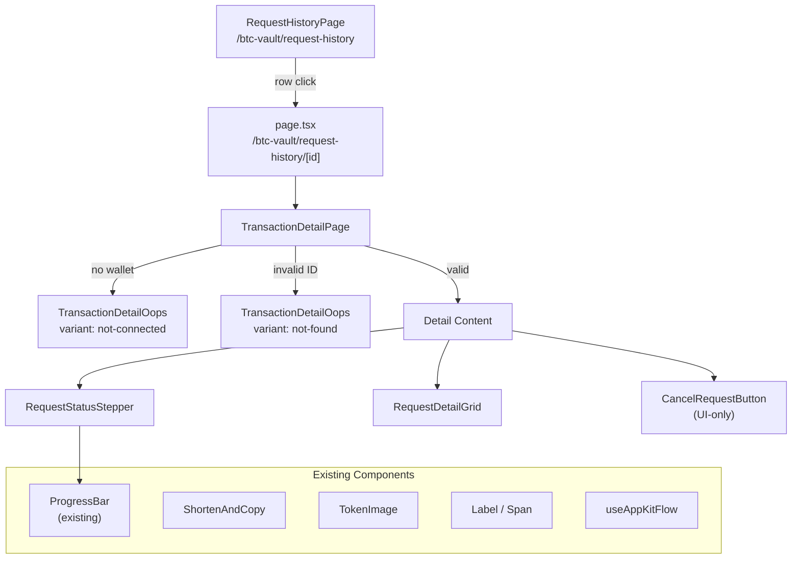
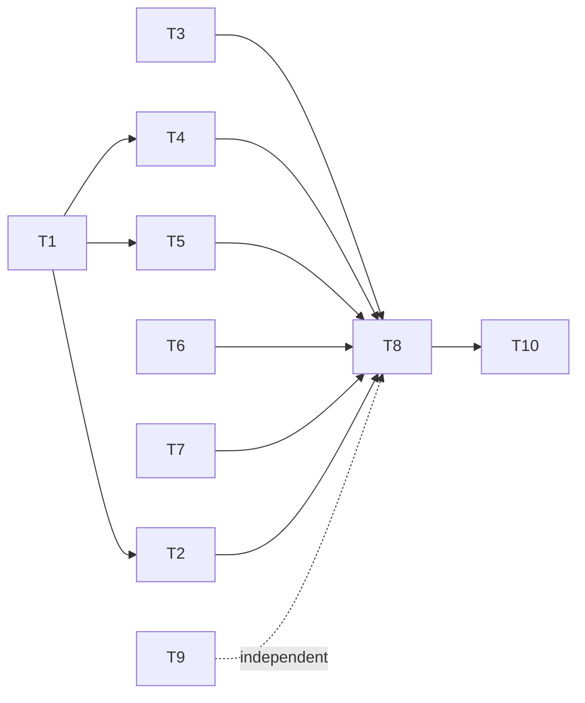

# BTC Vault Transaction Detail Page

## User Story

**Title:** Transaction Detail Page for BTC Vault Requests

**As a** BTC Vault user,
**I want** to view the full details of a deposit or withdrawal request on a dedicated page,
**so that** I can track its lifecycle status, see key information (shares, value, timestamps, addresses, tx hashes), and cancel a pending request if needed.

### Acceptance Criteria

1. Navigating to `/btc-vault/request-history/{id}` displays the Transaction Detail page for that request.
2. The page title reads "WITHDRAWAL REQUEST" or "DEPOSIT REQUEST" based on the request type.
3. A 4-stage status stepper is displayed:
   - Withdrawal: **SUBMITTED > PENDING > APPROVED > REDEEMED**
   - Deposit: **SUBMITTED > PENDING > APPROVED > DEPOSITED**
   - The current stage is visually highlighted with a gradient progress bar.
   - Failed requests show a **FAILED** branch.
4. The detail grid displays the following fields in a two-column layout:
   - **Request type** (Withdrawal / Deposit)
   - **Shares requested** (formatted share amount)
   - **Shares value** (rBTC amount with token icon + USD equivalent)
   - **Created on** (formatted date)
   - **Last status update** (formatted date)
   - **Withdrawal/Deposit address** (shortened, with copy)
   - **Tx hash** (shortened, with copy)
5. A "Cancel request" button is visible only when the request status is `pending`. (UI only -- no backend wiring in this story.)
6. Breadcrumbs show: **Home / BTC Vault / Request History / Transaction Detail**.
7. The page is gated behind the `btc_vault` feature flag (redirects to `/` when disabled).
8. When the user's wallet is not connected, the page shows an "oops" state with a message (e.g. "Connect your wallet to view request details") and a "Connect Wallet" button (using `useAppKitFlow`).
9. When the request ID does not match any known request, the page shows the same "oops" state layout with a "Request not found" message and a "Back to Request History" link.

---

## Current State After Merge

Key existing pieces to build on:

- **[RequestProcessingBlock](src/app/btc-vault/components/RequestProcessingBlock.tsx)** -- already implements the 4-stage stepper (Submitted > Pending > Approved > Successful) with `ProgressBar`, used in `ActiveRequestSection` on the main page.
- **[ActiveRequestDisplay](src/app/btc-vault/services/ui/types.ts)** (lines 52-69) -- already has `amountFormatted`, `sharesFormatted`, `usdEquivalentFormatted`, `lastUpdatedFormatted`, and other display fields.
- **[toActiveRequestDisplay](src/app/btc-vault/services/ui/mappers.ts)** (lines 143-169) -- mapper from `VaultRequest` + `ClaimableInfo` to display type.
- **Route exists**: `/btc-vault/request-history` with placeholder `RequestHistoryPage`.
- **Shared components**: `ShortenAndCopy`, `SectionContainer`, `ProgressBar`, `TokenImage`, `Label`/`Span` typography.
- **Error patterns**: `BtcVaultBanners` handles wallet disconnect / not-authorized with `StackableBanner`; `GlobalErrorBoundary` handles runtime crashes. Neither covers "entity not found" or "wallet required on a detail page".

---

## Architecture



---

## Design-to-Code Mapping

The screenshot shows these fields in a 2-column grid layout. Here is how each maps to existing data:

- **Request type** -- `request.type` ("Withdrawal" or "Deposit") -- already in `ActiveRequestDisplay.type`
- **Shares requested** -- `ActiveRequestDisplay.sharesFormatted` (withdrawal amount in shares)
- **Shares value** -- `ActiveRequestDisplay.amountFormatted` + `TokenImage` + `usdEquivalentFormatted`
- **Created on** -- `ActiveRequestDisplay.createdAtFormatted`
- **Last status update** -- `ActiveRequestDisplay.lastUpdatedFormatted`
- **Withdrawal address** -- user's connected wallet address (from `useAccount`) -- needs `ShortenAndCopy`
- **Tx hash** -- `VaultRequest.txHashes.submit` -- needs `ShortenAndCopy`
- **Cancel request** -- button, UI-only, shown only when `status === 'pending'`

The stepper shows 4 stages; the last stage label differs by type:

- Withdrawal: **SUBMITTED > PENDING > APPROVED > REDEEMED**
- Deposit: **SUBMITTED > PENDING > APPROVED > DEPOSITED**

This differs from `RequestProcessingBlock` which uses generic "Successful". The detail page stepper will accept `RequestType` to render the correct final label.

---

## Technical Tasks

### T1 -- Add `RequestDetailDisplay` type and mapper

**Scope:** Types + mapper + unit tests
**Files:** `services/ui/types.ts`, `services/ui/mappers.ts`, `services/ui/mappers.test.ts`

Add `RequestDetailDisplay` interface extending `ActiveRequestDisplay`:

```typescript
export interface RequestDetailDisplay extends ActiveRequestDisplay {
  typeLabel: string          // "Withdrawal" or "Deposit"
  addressShort: string       // shortened user address
  addressFull: string        // full user address
  submitTxShort: string | null
  submitTxFull: string | null
  canCancel: boolean         // true when status === 'pending'
}
```

Add `toRequestDetailDisplay(req, claimableInfo, rbtcPrice, userAddress)` mapper that delegates to existing `toActiveRequestDisplay` and adds the detail-specific fields.

### T2 -- Create `useRequestById` mock hook

**Scope:** Data hook
**Files:** `hooks/useRequestById/useRequestById.ts`, `hooks/useRequestById/index.ts`

Mock hook that returns a single `VaultRequest` by ID. Reuses the same mock data array from `useRequestHistory` filtered by ID. Returns `{ data: VaultRequest | null, isLoading: boolean }`.

### T3 -- Add `btcVaultRequestDetail` route helper

**Scope:** Routing constant
**Files:** `src/shared/constants/routes.ts`

Add: `export const btcVaultRequestDetail = (id: string) => `/btc-vault/request-history/${id}``

### T4 -- Build `RequestStatusStepper` component

**Scope:** UI component + unit test
**Files:** `request-history/[id]/components/RequestStatusStepper.tsx`, `RequestStatusStepper.test.tsx`

Enhanced stepper based on `RequestProcessingBlock` logic. Props: `status: RequestStatus`, `type: RequestType`. Renders stage labels with `>` separators, highlights current stage, uses `ProgressBar` with gradient colors. Failed state shows a "FAILED" branch (similar to `ProposalProggressBar`).

### T5 -- Build `RequestDetailGrid` component

**Scope:** UI component
**Files:** `request-history/[id]/components/RequestDetailGrid.tsx`

Two-column responsive grid of label/value pairs. Uses `Label`/`Span` from Typography, `ShortenAndCopy` for address and tx hash, `TokenImage` for rBTC icon, USD equivalent display.

### T6 -- Create `CancelRequestButton` component (UI-only)

**Scope:** UI component
**Files:** `request-history/[id]/components/CancelRequestButton.tsx`

Bordered/outlined button matching the design. Only rendered when `status === 'pending'`. `onClick` is a no-op placeholder.

### T7 -- Build `TransactionDetailOops` component

**Scope:** Error/empty state component
**Files:** `request-history/[id]/components/TransactionDetailOops.tsx`

Accepts a `variant` prop: `'not-connected'` or `'not-found'`.

- **`not-connected`**: Shows message "Connect your wallet to view request details" with a "Connect Wallet" button using `useAppKitFlow().onConnectWalletButtonClick`.
- **`not-found`**: Shows message "Request not found" with a "Back to Request History" link pointing to `/btc-vault/request-history`.

Both variants share the same layout (centered content, consistent with the dark BTC vault theme).

### T8 -- Create `TransactionDetailPage` and Next.js route

**Scope:** Page + route entry
**Files:** `request-history/[id]/TransactionDetailPage.tsx`, `request-history/[id]/page.tsx`

Page logic:
1. Check `useAccount()` -- if no wallet connected, render `TransactionDetailOops variant="not-connected"`.
2. Call `useRequestById(id)` -- if request is `null` (and not loading), render `TransactionDetailOops variant="not-found"`.
3. Otherwise render the detail content: title, `RequestStatusStepper`, `RequestDetailGrid`, `CancelRequestButton`.

Route entry wraps with `withServerFeatureFlag` (same pattern as `request-history/page.tsx`).

### T9 -- Update breadcrumbs

**Scope:** Navigation
**Files:** `src/components/Breadcrumbs/Breadcrumbs.tsx`

Add to `breadcrumbsMap`:
- `'/btc-vault': 'BTC Vault'`
- `'/btc-vault/request-history': 'Request History'`

The dynamic `[id]` segment will show as "Transaction Detail" via breadcrumb label override or a dedicated mapping pattern.

### T10 -- Write unit tests

**Scope:** Tests
**Files:** `TransactionDetailPage.test.tsx`, `RequestStatusStepper.test.tsx`

- Page tests: renders with mock data, verifies title/fields/cancel button visibility, verifies oops state for disconnected wallet, verifies oops state for invalid ID.
- Stepper tests: correct step highlighting for each `RequestStatus`, correct final label per `RequestType`, failed state branch.
- Mapper tests in `mappers.test.ts` for `toRequestDetailDisplay`.

---

## Task Dependencies



- **T1** (types/mapper) is the foundation -- T2, T4, and T5 depend on the display type.
- **T3** (route constant) and **T9** (breadcrumbs) are independent and can be done in parallel.
- **T7** (oops component) is independent and can be built in parallel with T4-T6.
- **T8** (page assembly) pulls everything together.
- **T10** (tests) comes last.
