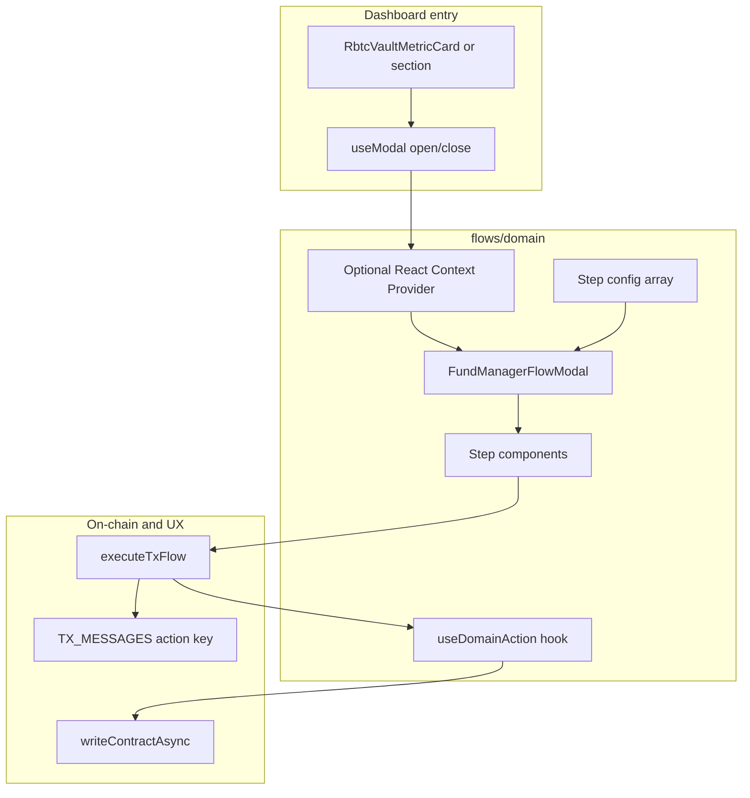

# Fund Manager — CTA flows (developer guide)

Team-facing guide for adding **Call-to-Action (CTA) modals** on the Fund Manager page: multi-step flows that end in an on-chain write (or sequence of writes). Use this document and [`.cursor/rules`](../../../.cursor/rules/) as the source of truth for conventions.

**Reference implementation:** Top Up Buffer under [`flows/buffer/`](./flows/buffer/).

---

## Audience and goals

- **Who:** Developers implementing CTAs such as Update NAV, Deposit to Vault, Synthetic Yield APY, Transfer to Manager Wallet, etc.
- **You should be able to:**
  1. Know which files to create and where.
  2. Understand how the modal shell, steps, and actions connect.
  3. Plug in contract calls when product/spec defines them (or ship a **stub** with TODOs first).
  4. Reuse shared fund-manager UI/hooks vs CTA-specific code.
  5. Align with Typography, token symbols (`RBTC` / `WRBTC`), `executeTxFlow`, and testing rules.

---

## Mental model

- Each CTA is a **modal** containing a **multi-step flow**. **One PR per CTA** is acceptable; shared pieces live in [`components/`](./components/) and [`hooks/`](./hooks/).
- **Folder naming:** Short **domain** folders under `flows/` (e.g. `buffer`, `nav`, `deposit`, `synthetic-yield`, `transfer`). Use **descriptive** file names inside (e.g. `TopUpBufferFlow.tsx`).

---

## Core types and shell (stable API)

Defined in [`types.ts`](./types.ts).

| Type | Purpose |
|------|---------|
| **`FlowStepProps`** | Props every step receives: `onGoNext`, `onGoBack`, `onGoToStep`, `onCloseModal`, `setButtonActions`. |
| **`FlowStepConfig`** | One step in the flow: `component`, `label`, `description`, `progress` (0–100 for the progress bar). |
| **`ButtonActions`** | Primary/secondary footer buttons; re-exported from `@/components/StepActionButtons`. |

### `FundManagerFlowModal`

[`components/FundManagerFlowModal.tsx`](./components/FundManagerFlowModal.tsx) composes:

- [`Modal`](../../components/Modal)
- [`FlowStepLabels`](./components/FlowStepLabels.tsx)
- [`ProgressBar`](../../components/ProgressBarNew)
- [`StepActionButtons`](../../components/StepActionButtons)
- [`useSteps`](../../shared/hooks/useSteps.ts) with **`maxSteps = stepConfig.length`**

Steps **do not** own the footer; they register actions via **`setButtonActions`** (typically in a `useEffect`).

### Dynamic `stepConfig`

`stepConfig` may be **static** or **computed** (see Top Up Buffer: different paths for native vs wrapped token). If the number or order of steps **changes at runtime**, validate that the current **step index** still makes sense (e.g. reset to `0` when a branch changes, or use `onGoToStep`). Add an effect in the flow entry or modal wrapper if needed—**verify** when introducing new branching.

---

## Reference implementation: Top Up Buffer

| Piece | Location | Role |
|-------|----------|------|
| Entry + provider | [`flows/buffer/TopUpBufferFlow.tsx`](./flows/buffer/TopUpBufferFlow.tsx), [`TopUpBufferContext.tsx`](./flows/buffer/TopUpBufferContext.tsx) | Opens shell; optional shared state across steps |
| Step list | [`flows/buffer/topUpBufferStepConfig.ts`](./flows/buffer/topUpBufferStepConfig.ts) | Labels, descriptions, progress, component mapping |
| Steps | [`flows/buffer/steps/`](./flows/buffer/steps/) | Step UI + `setButtonActions` |
| Writes | [`flows/buffer/hooks/useTopUpBuffer.ts`](./flows/buffer/hooks/useTopUpBuffer.ts) | Thin `writeContractAsync` helpers → `Promise<Hash>` |

---

## Dashboard CTAs → Solidity entrypoints

Wire each flow’s write hook to the matching contract and function (see `rbtc-vault-sc`: `RBTCAsyncVault`, `SyntheticYield`, `Buffer`). Labels match [`RbtcVaultMetricsSection.tsx`](./components/RbtcVaultMetricsSection.tsx).

- **Update NAV** — `RBTCAsyncVault.reportOffchainAssetsAndProcessFunding(uint256 reportedOffchainAssets_)`.
- **Deposit to Vault** — `RBTCAsyncVault.moveCapitalIn(uint256 assets)`; native: `RBTCAsyncVault.moveCapitalInNative()` (payable).
- **Transfer to Manager Wallet** — `RBTCAsyncVault.moveCapitalOut(uint256 assets, address destination)`; native: `RBTCAsyncVault.moveCapitalOutNative(uint256 assets, address payable destination)`.
- **Top Up Synthetic Yield APY** — rate: `SyntheticYield.setSyntheticYieldRate(uint256 newApyBasisPoints)`; add funds: `SyntheticYield.fund(uint256 assets_)` or `SyntheticYield.fundNative()` (payable). Epoch application is triggered from the vault via `onEpochFinalization` (vault-only), not from the dashboard.
- **Top Up Buffer** (reference) — `Buffer.inject(uint256 assets)` or `Buffer.injectNative()` (payable).

**Not dashboard CTAs:** `Buffer.draw` / `Buffer.repay` are **vault-only**. `RBTCAsyncVault.processFunding()` is permissionless (utility poke, not a labeled metric button). **`PermissionsManager`** holds roles (`grantRole` / `revokeRole` via OpenZeppelin AccessControl); it does not replace the NAV or capital-move calls above.

---

## Checklist: implement a new CTA

1. **Create `flows/<domain>/`** (short domain name).

2. **Add `<Name>Flow.tsx`**
   - Render `FundManagerFlowModal` with `title`, `onClose`, and `stepConfig` (constant or `useMemo`).

3. **Add `<domain>StepConfig.ts` (or inline)**
   - Export a `FlowStepConfig[]` (or a getter) aligned with **Figma** step labels and progress.

4. **Implement step components** under `flows/<domain>/steps/`
   - Mark `'use client'` where you use hooks or event handlers.
   - Use **Typography** (`Header`, `Paragraph`, `Label`, `Span` from `@/components/Typography`). Avoid raw `` and ad-hoc font utility stacks for text—see [architecture-patterns.mdc](../../../.cursor/rules/architecture-patterns.mdc) and Typography docs.

5. **Optional: `*Context.tsx`**
   - If amount, token, NAV input, etc. is shared across steps, provide a React context (same pattern as `TopUpBufferContext`).

6. **Contract layer (when known — or stub first)**
   - **Contract config:** Add or reuse an entry in [`src/lib/contracts.ts`](../../lib/contracts.ts) (or another established contracts module) with ABI + address.
   - **Per-CTA write hook:** `flows/<domain>/hooks/use<Domain>Action.ts` exposing one or more functions that return **`Promise<Hash>`** using `useWriteContract` / `writeContractAsync` (mirror `useTopUpBuffer`).
   - **Before functions are known:** implement the hook with `// TODO(DAO-XXXX): wire contract` and `throw new Error('Not implemented')` or similar, and keep the confirm step wired to `executeTxFlow` behind a disabled button until ready.
   - **Confirm step:** Call [`executeTxFlow`](../../shared/notification/executeTxFlow.ts) with `onRequestTx: () => yourHook(...)`, `action: '<yourTxMessagesKey>'`, and `onSuccess` (e.g. close modal).

7. **Toasts**
   - Add a new key to [`src/shared/txMessages.ts`](../../shared/txMessages.ts).
   - Pass that key as `action` into `executeTxFlow`.
   - For **ERC-20 allowance only**, you can mirror the buffer flow: [`useErc20Allowance`](./hooks/useErc20Allowance.ts) + [`useContractWrite`](../../shared/hooks/useContractWrite.ts) + `executeTxFlow` with a dedicated `action` (e.g. `bufferAllowance`).

8. **Wire the entry point**
   - Example: [`RbtcVaultMetricsSection.tsx`](./components/RbtcVaultMetricsSection.tsx) uses [`useModal`](../../shared/hooks/useModal.ts), passes `onButtonClick` to [`RbtcVaultMetricCard`](./components/RbtcVaultMetricCard.tsx), and conditionally renders `<YourFlow onClose={...} />` when the modal is open.

9. **Tests**
   - Follow [documentation-and-testing.mdc](../../../.cursor/rules/documentation-and-testing.mdc): Vitest for shared hooks with logic, utilities, stores; co-locate test files.

---

## Reusable building blocks

Use these when the UX matches; do not force-fit unrelated CTAs.

| Asset | Path | When to use |
|-------|------|----------------|
| Amount card | [`components/AmountInputSection.tsx`](./components/AmountInputSection.tsx) | Token amount + balance + percentage shortcuts |
| Token picker | [`components/TokenSelector.tsx`](./components/TokenSelector.tsx) | Native `RBTC` vs `WRBTC` (symbols from constants) |
| Confirmation rows | [`components/ConfirmationDetail.tsx`](./components/ConfirmationDetail.tsx) | Label + large value + optional USD / icon |
| Flow shell | [`components/FundManagerFlowModal.tsx`](./components/FundManagerFlowModal.tsx) | Any multi-step fund-manager modal |
| Step labels | [`components/FlowStepLabels.tsx`](./components/FlowStepLabels.tsx) | Chevrons between step names (used by shell) |

| Hook | Path | When to use |
|------|------|-------------|
| `useAmountInput` | [`hooks/useAmountInput.ts`](./hooks/useAmountInput.ts) | Amount string, validation, % buttons, native gas reserve |
| `useTokenSelection` | [`hooks/useTokenSelection.ts`](./hooks/useTokenSelection.ts) | Native vs wrapped + balances |
| `useErc20Allowance` | [`hooks/useErc20Allowance.ts`](./hooks/useErc20Allowance.ts) | Generic approve flow for a spender |
| `useVaultAsset` / reads | [`hooks/useVaultAsset.ts`](./hooks/useVaultAsset.ts), [`useReadRbtcBuffer`](../../shared/hooks/contracts/btc-vault/useReadRbtcBuffer.ts) | Vault asset and buffer reads (`bufferAssets`, `bufferDebt`, etc.) |
| Top-up WrBTC ERC-20 | `WRBTC_ADDRESS` / `NEXT_PUBLIC_WRBTC_ADDRESS` in [`@/lib/constants`](../../lib/constants.ts) | Wrapped token address for buffer top-up (`TopUpBufferContext`); not read from `buffer.asset()` |

**Constants:** Import **`RBTC`** and **`WRBTC`** from `@/lib/constants`. Native display is environment-dependent (`rBTC` vs `tRBTC`); wrapped label is always `WRBTC`. Use **`TokenImage`** with `symbol={RBTC}` for both native and wrapped visuals when product says they share the same icon.

---

## Contract abstraction (guidance)

- **Do not** build a single stringly-typed “run any CTA” executor; it hides call sites and weakens typing.
- **Do** keep **`executeTxFlow` + `TX_MESSAGES`** at the UI boundary for consistent toasts and error handling.
- **Do** keep **thin, per-CTA hooks** that return **`Promise<Hash>`** for each distinct `writeContractAsync` call.
- **Approve + act:** Prefer separate steps (allowance step + confirm) or two `executeTxFlow` calls unless product requires a different UX.

---

## Out of scope and PR discipline

- Avoid drive-by refactors in unrelated features (e.g. `btc-vault`) unless the ticket explicitly includes them.
- Keep the PR scoped to the CTA and necessary shared fund-manager primitives; broader cleanup should be a separate agreement/ticket.

---

## Appendix

### Historical references (not templates)

Older user flows under `src/app/user/Stake` and `src/app/user/Swap` informed shared pieces (`useSteps`, `StepActionButtons`). **New fund-manager CTAs** should follow **`FundManagerFlowModal` + `flows/buffer`** as the primary pattern.

### Figma

Use **Figma Dev Mode** or the **Figma MCP** (`get_design_context`) to match spacing and hierarchy. Map to existing **Typography** variants and design tokens rather than copying raw Figma CSS font stacks into JSX.

---

## Success criteria (for a new CTA PR)

- A developer can land a **stub** flow (steps + modal + dashboard trigger) before final contract ABIs/functions are fixed, with **TODO(DAO-XXXX)** in the write hook and any gated confirm action.
- Once specs exist, the same structure accommodates real `writeContractAsync` calls without restructuring the whole feature.
